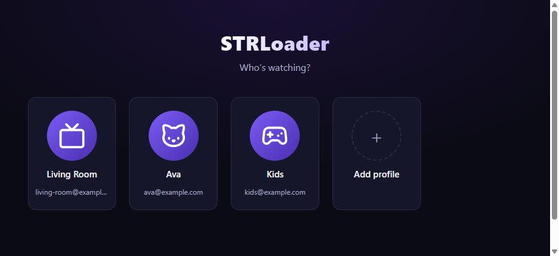
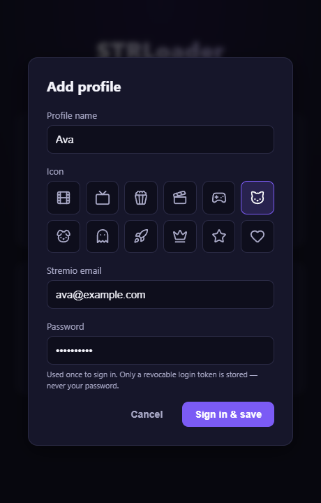
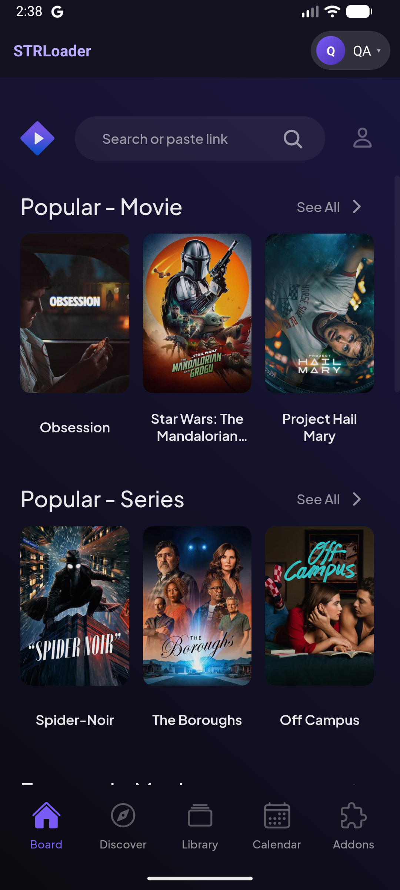

# STRLoader

A **"Who's watching?" profile picker for Stremio.** Stremio has no built-in profile switching — one app, one logged-in account. STRLoader signs into a chosen account and opens Stremio already logged in. One monorepo, two apps:

> Not affiliated with, endorsed by, or sponsored by Stremio. "Stremio" is used only to describe compatibility.

| App | Platform | What it drives | Tech | Status |
|-----|----------|----------------|------|--------|
| [`windows/`](windows/) | Windows desktop | the **native** Stremio app | Electron launcher | ✅ verified driving native Stremio 5 |
| [`android/`](android/) | Android phone / tablet / TV | a wrapped **Stremio Web** session | Kotlin WebView | ✅ in-app switcher, landscape playback, runs on Android/Google TV |

> **How it works in one line:** you add each profile once (email + password); the loader signs in via the Stremio API, stores only a revocable login token, and on launch seeds that session into Stremio so it opens straight into your account. Your password is never stored.

The two platforms reach Stremio differently — see below — but both share the same picker UI and login logic. Full details in [docs/HOW-IT-WORKS.md](docs/HOW-IT-WORKS.md); the API/storage contract is in [docs/STREMIO-API.md](docs/STREMIO-API.md).

## Screenshots

The "Who's watching?" picker — the same UI on Windows and Android:



<table>
<tr>
<td valign="top">

Adding a profile, with open-source [Lucide](https://lucide.dev) icons. Only a revocable login token is stored — never your password:



</td>
<td valign="top">

On Android, the chosen profile loads inside Stremio with a STRLoader top bar (active profile + switcher):



</td>
</tr>
</table>

## Download

Grab the latest **Windows installer** (`.exe`) and **Android APK** from the
**[Releases page →](https://github.com/BaconWappedBitcoin/stremio-profile-loader/releases/latest)**

- **Windows:** download and run the installer. You must also have the official [Stremio desktop app](https://www.stremio.com/downloads) installed — STRLoader drives it.
- **Android:** download `STRLoader.apk` on the device and open it (you'll be asked to allow "install unknown apps" the first time). See [Sideloading](#sideloading-the-android-apk). Best with debrid/HTTP addons.

Prefer to build from source? See [Quick start](#quick-start).

---

## What it is (and isn't)

Not affiliated with or endorsed by Stremio. Stores only a Stremio **authKey** (a revocable session token) per profile — never your password.

**Windows → drives the real native app.** Picking a profile (re)starts the installed `stremio.exe` with its embedded browser engine's remote-debugging enabled, attaches over the Chrome DevTools Protocol, seeds the chosen session into `localStorage`, and reloads — so your **native** Stremio opens signed into that account. Because it's the native app, **torrent (P2P) streaming and the bundled streaming server work normally.** A small **Switch** chip is injected at the bottom of Stremio; clicking it reopens the picker so you can change profiles without hunting for the launcher window. (Switching is a relaunch into the other account, not a live in-app swap.)

> ⚠️ This relies on the native shell exposing remote debugging. Builds vary, so run `npm run doctor` on your machine first — it tells you whether your Stremio can be driven this way.

**Android → wraps Stremio Web.** Android's official Stremio app is closed-source and sandboxed, so no external launcher can change its profile without root. Instead the Android app embeds a Stremio Web session and seeds the chosen profile into it. A slim top bar shows the active profile and lets you **switch profiles in place** (Netflix-style selector) without leaving the app. Video plays **fullscreen in landscape**, and **Back** returns to Stremio's home (not out to the picker). Best suited to **debrid / HTTP-addon** setups (Real-Debrid, Premiumize, Torrentio+debrid, direct HTTP addons); plain torrent P2P needs a local streaming server that a WebView can't provide. Installs on phones, tablets, **Android TV and Google TV** (e.g. ONN, Chromecast, Fire TV).

## Repository layout

```
stremio-profile-loader/
├── shared/
│   ├── stremio-api.js      # Stremio API + profile-building logic (used by Electron)
│   └── picker/             # the profile-picker UI, shared by BOTH apps
│       ├── index.html
│       ├── styles.css
│       └── app.js          # talks only to window.LoaderBridge
├── windows/                # Electron launcher that drives the native Stremio app
│   ├── src/native.js       #   finds Stremio, restarts it with debugging, injects via CDP
│   └── scripts/doctor.js   #   `npm run doctor` — checks your install is drivable
├── android/                # Kotlin WebView app (phone/tablet/TV)
└── docs/
```

Both apps render the **same** picker UI and expose the **same** `window.LoaderBridge` interface; only the platform glue (storage + launching) differs.

## Quick start

### Windows (Electron launcher + native Stremio app)

Requires the official **Stremio desktop app** installed.

```bash
cd windows
npm install
npm run doctor         # FIRST: verify your Stremio install can be driven
npm start              # launch the profile picker
npm run dist           # build an installer (NSIS)
```

> Building the installer locally needs Windows **Developer Mode** on (Settings → Privacy & security → For developers) or an elevated shell, so electron-builder can extract its signing tools (they contain symlinks). CI does this automatically — see [Releases](#releases).

If `npm run doctor` reports the DevTools port never opened, your Stremio build doesn't expose remote debugging — [open an issue](../../issues) with your version (Settings → About) so the injection method can be adapted.

### Android

Open the `android/` folder in **Android Studio** (Otter or newer) and Run, or from the CLI:

```bash
cd android
./gradlew assembleDebug          # -> app/build/outputs/apk/debug/app-debug.apk
adb install -r app/build/outputs/apk/debug/app-debug.apk
```

Requires Android SDK with **API 36** + **build-tools 36.0.0** (AGP 8.9.1 / Gradle 8.11.1, JDK 17+). Installs on phones, tablets, and Android TV.

### Sideloading the Android APK

The APK is signed with a **stable, committed key** (see [`android/keystore/`](android/keystore/README.md)), so new versions install **in place over older ones — no uninstall needed**. (One exception: upgrading from v0.1.0 or v0.1.1, which predate that key, needs a single uninstall.)

**Phone / tablet**
1. Download `STRLoader.apk` onto the device (from [Releases](https://github.com/BaconWappedBitcoin/stremio-profile-loader/releases/latest)) or transfer it over.
2. Open it in your **Files** / Downloads app and tap **Install**.
3. First time, Android blocks it: tap **Settings → Allow from this source** for the app you opened it with, then install again.
4. **Play Protect** may warn about an unknown app → **Install anyway**.

**ADB**
```bash
# enable Settings → About → tap "Build number" 7× → Developer options → USB debugging
adb install -r STRLoader.apk
```

> 💡 The latest APK is always at this stable URL (handy for the steps below):
> `https://github.com/BaconWappedBitcoin/stremio-profile-loader/releases/latest/download/STRLoader.apk`

**ONN (Walmart) / Google TV / Android TV boxes & sticks**

These have no browser or file manager, so use the **Downloader** app:

1. **Unlock Developer options:** Settings → System → About → scroll to **Build** (or "Android TV OS build") and click it **7 times**.
2. **Install Downloader** (by AFTVnews) from the Google Play Store on the device.
3. **Allow it to install apps:** Settings → Apps → Security & restrictions → **Unknown sources** → turn on **Downloader**. (On some ONN boxes this prompt appears the first time you install instead.)
4. Open **Downloader**, and in the URL box enter the stable APK link above (the on-screen keyboard works, or use a URL shortener you make yourself). Press **Go**.
5. It downloads, then shows **Install** → confirm. If **Play Protect** warns, choose **Install anyway** / **More details → Install**.
6. Launch **STRLoader** from your apps row (it appears in the Google TV / Android TV launcher). Add a profile with the on-screen keyboard, then select it.

**ADB over the network** (alternative, e.g. for ONN or Fire TV):

```bash
# On the device: Settings → System → Developer options → enable "USB/Network debugging".
adb connect <TV-IP>:5555      # find the IP in Settings → Network/About
adb install -r STRLoader.apk
```

## Usage

1. Launch the loader — you'll see the profile picker.
2. **Add profile** → give it a name, enter the Stremio email + password. The loader signs in once and stores the returned token.
3. Click a profile:
   - **Windows:** any running Stremio is closed and the native app relaunches signed into that account.
   - **Android:** Stremio Web opens signed into that account, with a top bar showing who's active.
4. To switch profiles:
   - **Android:** tap the profile chip in the top bar and pick another — it switches in place. "Manage profiles…" opens the picker to add/edit/remove.
   - **Windows:** click the **Switch** chip at the bottom of Stremio (or bring the picker window back up) and pick another profile — the native app relaunches into it.
5. Edit a profile's name/icon with the ✏️ on its card, or remove it with the × (removing only deletes it locally; your Stremio account is untouched).

If a stored token ever expires, the loader will tell you to remove and re-add that profile.

## Keeping up with Stremio

STRLoader bundles **none** of Stremio's code — it points at Stremio's live web app (`web.stremio.com`). So it **always runs Stremio's latest web version automatically**, with no rebuild when Stremio ships an update. (Stremio's *native* APK is irrelevant — STRLoader uses Stremio Web, not the native app.)

STRLoader's own code only needs updating if Stremio changes the **contract** it depends on to inject a session — the login API or the localStorage profile schema — both centralized in [`shared/stremio-api.js`](shared/stremio-api.js) (`SCHEMA_VERSION` + `DEFAULT_SETTINGS`). The symptom of such a change is landing on Stremio's login screen instead of signed in.

Native-only features (the bundled torrent streaming server, native players) aren't part of Stremio Web, so they never appear in the Android wrapper regardless of Stremio updates — that's the inherent wrapper ceiling.

## Security notes

- Passwords are used exactly once (at "Add profile") and never written to disk.
- The stored authKey is a bearer token for that Stremio account — treat the profile file like a password. It lives in the OS per-user app data:
  - Windows: `%APPDATA%/STRLoader/profiles.json`
  - Android: app-private `SharedPreferences` (not world-readable)
- You can revoke a token any time by changing the account's Stremio password.

## Releases

A [GitHub Actions workflow](.github/workflows/release.yml) builds the Windows installer and the Android APK. To cut a release:

```bash
# bump versions in windows/package.json and android/app/build.gradle.kts, then:
git tag v0.1.0
git push origin v0.1.0
```

The workflow builds both apps and attaches the installer + `STRLoader.apk` to a [GitHub Release](https://github.com/BaconWappedBitcoin/stremio-profile-loader/releases) for that tag. You can also trigger it manually (Actions → Build & Release → Run workflow) to get the build **artifacts** without publishing a release — note those are zipped under the run page and are not the same as a Release.

## License

[MIT](LICENSE). Not affiliated with or endorsed by Stremio.
